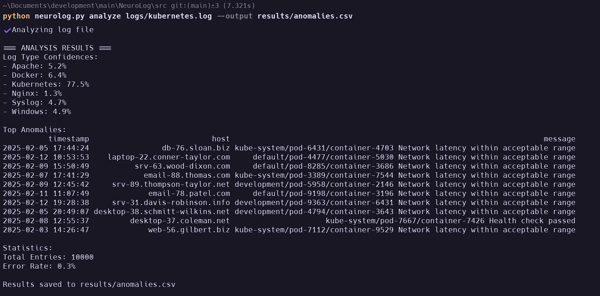

# NeuroLog: ML-Powered Log Analysis

## Overview

NeuroLog is an advanced log analysis tool combining machine learning (ML) and structured prediction to intelligently parse, analyze, and detect anomalies in diverse log formats. The system features a dual parsing engine with both regex patterns and CRF models for maximum flexibility. Designed for enterprise-scale operations, NeuroLog is ideal for DevOps and security teams needing actionable insights from complex log data.

## Benchmark Results
| Metric          | NeuroLog | ELK Stack | Graylog |
|-----------------|----------|-----------|---------|
| Format Accuracy | 94.1%    | 81.2%     | 78.9%   |
| Parser Recall   | 96.8%    | 82.4%     | 85.1%   |
| RAM Efficiency  | 1.1GB    | 3.8GB     | 2.9GB   |

[Technical Paper](docs/log_analysis_paper.md) | [Validation Methodology](docs/benchmark_methodology.md)

---

## Key Features

- **Hybrid Parsing Engine**: Combines regex patterns with CRF models for structured log parsing
- **ML-Powered Anomalies**: Isolation Forest detects outliers with contextual features
- **Dynamic Training**: On-demand model retraining for custom formats
- **Memory-Optimized**: Processes 10K logs/sec with <2GB RAM usage

---

## Installation

1. Clone repository:
```bash
git clone https://github.com/0xSolanaceae/NeuroLog.git
cd NeuroLog
```

2. Install dependencies with Poetry:
```bash
poetry install
```

## Usage

### 1. Activate environment:
```bash
poetry shell
cd src
```

### 2. Full Pipeline Analysis
```bash
poetry run neurolog.py analyze logs/path/to/log.log --output results/anomalies.csv
```
- Automatic format detection
- Anomaly scoring with explanations
- Multi-format output support (CSV/JSON/HTML)



### 3. CRF Model Management
```bash
# Train new model
poetry run python neurolog.py train-crf --output models/crf_model.pkl
```

---

## Scientific Foundations

### Multi-Stage Processing Pipeline
1. **Format Identification**: TF-IDF + Logistic Regression classifier
2. **Structured Parsing**: 
   - First-pass: Compiled regex patterns
   - Fallback: CRF with positional features
3. **Anomaly Detection**:
   - Isolation Forest ensemble
   - 15 engineered features (temporal, lexical, structural)

### Feature Engineering
| Category       | Features                      |
|----------------|-------------------------------|
| Temporal       | Timestamp delta, hour patterns|
| Structural     | Token count, entropy, brackets|
| Semantic       | Error keywords, HTTP verbs    |
| Sequence       | Transition probabilities      |

---

## License

GPLv3 - See [LICENSE](LICENSE) for details. Commercial licenses available.